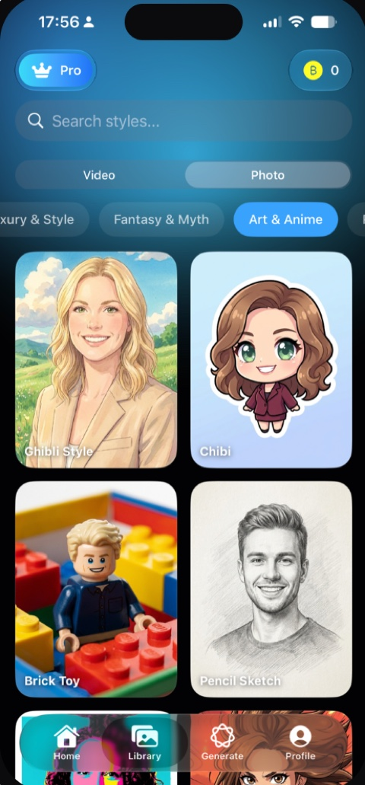

# FixFly

A native iOS app that turns a single selfie into AI-generated photoshoots, stylised portraits and short videos.

Pick a template, add one clear photo of your face, and the result comes back in seconds — ready to share. Built in Swift and SwiftUI, monetised with StoreKit, and powered by a FastAPI backend I also wrote.

**Released on the App Store** — [apps.apple.com/us/app/fixfly-ai](https://apps.apple.com/us/app/fixfly-ai/id6777982481)

## Screenshots

| Sign in | Home & trending | Browse styles |
|---|---|---|
|  |  |  |

| Themed pack | Add your photo | Your results |
|---|---|---|
|  |  |  |

## Features

- **AI Photoshoot** — one selfie becomes a full set of matched studio-quality photos.
- **Hundreds of templates** — portraits and avatars, anime and digital art, high-fashion editorial, cinematic action, fantasy, and retro looks, for both photos and video.
- **Together** — merges two photos into one short video.
- **Make Me Dance** — turns a still photo into a short dance clip.
- **Library** — every generation is kept, with a before/after comparison view.
- **Wallet and paywall** — auto-renewable weekly and monthly subscriptions plus consumable coin packs, with a welcome-bonus flow for new users.
- **Sign in with Apple** — the only account step, with the session held in the Keychain.

## Architecture

MVVM across **19 feature modules**, each owning its views, view models and API surface:

```
AppLoading  Auth      Duo        Generate   Home
Legal       Library   Navigation Onboarding Paywall
Photoshoot  Processing Profile   ResultCompare
Settings    Templates UploadFile Wallet     WelcomeBonus
```

`Core` holds the networking layer, session handling and shared services; `UIComponents` holds the reusable views the features are assembled from.

### Networking

A hand-rolled client over `URLSession` rather than a third-party stack:

- `ClientAPI` — typed JSON requests with `Codable` models and centralised error handling.
- `MultipartAPI` — multipart photo upload with progress reporting.
- `ConfigAPI` — resolves the backend base URL at launch and caches it, so the app can be pointed at a new host without a release.
- JWT stored in the Keychain through `TokenStore`, attached to every request, with `401` handled centrally.

### Generation pipeline

Generation is asynchronous end to end. The app uploads the photo, the backend queues a job, and the processing screen polls for status — the first check after 10 seconds, then every 5 seconds — until the finished media lands in the Library. Because a generation can outlast the user's patience, the processing screen offers a "Notify me when ready" option backed by a local notification.

## Tech

| Area | What is used |
|---|---|
| Language & UI | Swift, SwiftUI, Swift Concurrency (async/await), Combine |
| Architecture | MVVM, modular feature-based structure, reusable component library |
| Networking | URLSession, Codable, multipart upload, JWT with Keychain storage |
| Monetisation | StoreKit — auto-renewable subscriptions and consumable coin packs |
| System | AuthenticationServices (Sign in with Apple), UserNotifications, PhotosUI, AVKit, AppTrackingTransparency |
| Analytics | Firebase Analytics, attribution SDK, Instruments profiling |
| Backend | Python, FastAPI, PostgreSQL, deployed on Microsoft Azure |
| AI | Google Vertex AI and Veo for image and video synthesis, Kling AI for motion-transfer templates |

## Backend

The service powering the app is a separate project: authentication and token issuing, generation job queueing with status tracking, template catalogue delivery, coin balance accounting, and App Store subscription receipt validation. FastAPI and PostgreSQL, deployed to Azure with GitHub Actions.

## Building

Requires Xcode 26 or newer and an iOS 18+ device or simulator. Open `FixFly.xcodeproj` and run the `FixFly` scheme.

The app talks to a live backend and uses Sign in with Apple, so a simulator run without credentials will reach the onboarding and sign-in screens only. `GoogleService-Info.plist` is not committed; Firebase Analytics is optional and the app runs without it.

## Legal

[Privacy Policy](https://konansul.github.io/fixfly-legal/privacy.html) · [Terms of Use](https://konansul.github.io/fixfly-legal/terms.html)
